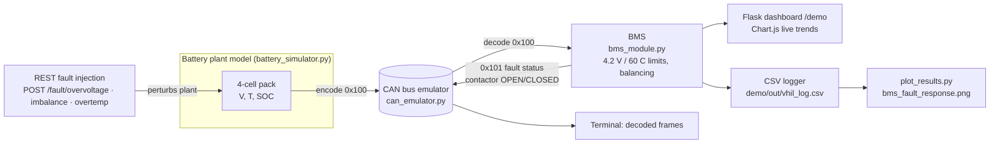

# Stage 5 Demo — Virtual HIL BMS Validation

Runs the V_HIL battery model -> CAN -> BMS -> dashboard/logger loop with REST fault injection,
and produces plots + logs in `demo/out/`.

## Run

```bash
demo/run_demo.sh                 # scripted: overvoltage@10s, imbalance@30s, overtemp@50s (75 s total)
demo/run_demo.sh --interactive   # no scripted faults; use dashboard buttons or curl
# in another terminal:
curl -X POST localhost:5001/fault/overvoltage      # also: imbalance | overtemp | clear
curl localhost:5001/status
```

Dashboard: <http://localhost:5001/demo> (the original repo page is still served at `/`).
Docker alternative for the stock app: `cd V_HIL && docker compose up --build`.

Artifacts written to `demo/out/`:

| File | What |
|---|---|
| `vhil_log.csv` | per-second log: 4 cell voltages, temperature, SOC, active fault, BMS status, contactor |
| `bms_fault_response.png` | SOC / cell voltages / temperature with fault windows + contactor-open markers |
| `can_terminal.txt` | decoded CAN traffic (`0x100` battery status, `0x101` fault status) |

## Real vs. host-simulated

| Component | Status |
|---|---|
| `battery_simulator.py` plant (cell voltages, temp, SOC drain) | Real repo code, runs on host |
| `can_emulator.py` + `can_messages.py` (IDs `0x100`/`0x101`) | Real repo code; in-process CAN emulation, no physical CAN transceiver |
| `bms_module.py` (limits 4.2 V / 60 C, balancing) | Real repo code, runs on host. **One fix**: safety check now runs before balancing (balancing was masking over-voltage) |
| `flask_dashboard2.py` Flask app + REST | Real repo code; the demo registers extra routes `/demo`, `/fault/<name>`, `/status` on the same app |
| `data_logger.py` | Superseded in the demo by a wider CSV (per-cell columns + fault/BMS/contactor) |
| Faults (over-voltage, imbalance, over-temperature) | Injected into the plant *upstream of CAN* by `demo/vhil_demo.py` — the BMS only sees CAN frames |
| `pyqt_visualizer.py` | Not exercised (headless run) |

Nothing here targets hardware; this stage is a pure virtual HIL bench. The same CAN payloads
would come from the STM32 ECU of stages 3-4 on a physical bench.

## Architecture


